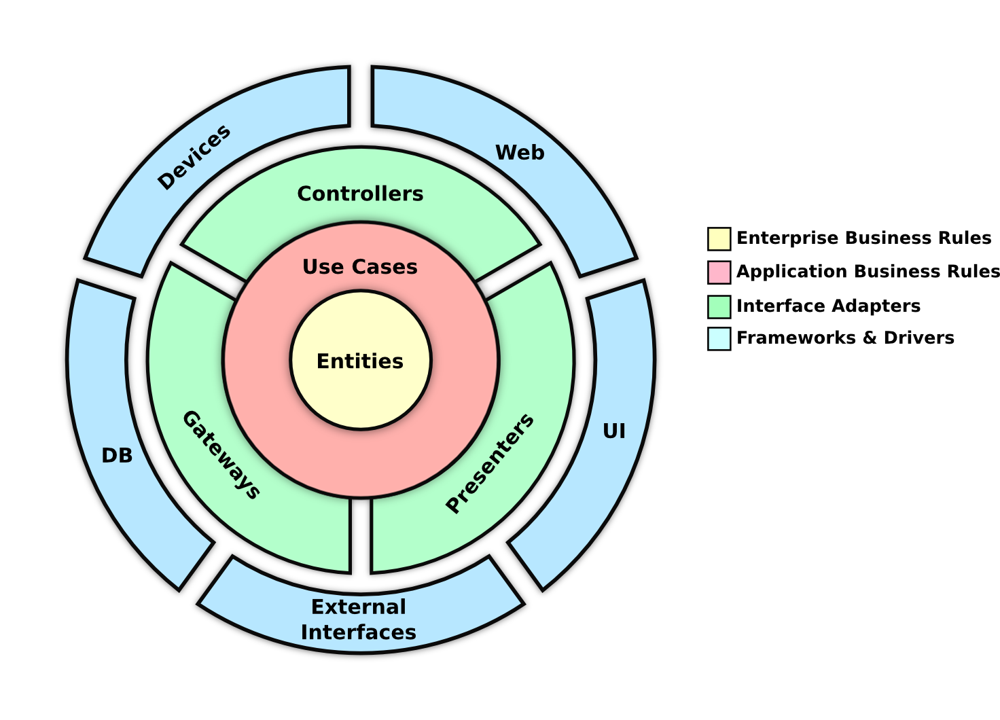

Robert C. Martin define a arquitetura limpa como uma série de indepências e desacoplamentos entre os módulos e componentes de software:[^1]
- Indepêndencia de frameworks
- Indepêndencia de interfaces gráficas 
- Indepêndencia de bancos de dados e SGBDs
- Indepêndencia de agentes e serviços externos

Normalmente quando ultrapassamos os limites e indepêndencias da arquitetura essas ultrapassagens são feitas com estruturas de dados nativas e simples a linguagem de programção do projeto, evitando ao máximo passar classes, objetos e estrturas oriundas de frameworks ou bibliotecas.[^2]

[^1]: Arquitetura limpa, páginas 202 a 203
[^2]: Arquitetura limpa, página 207
